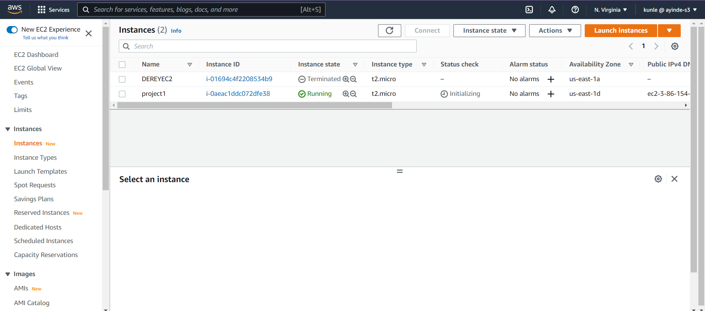
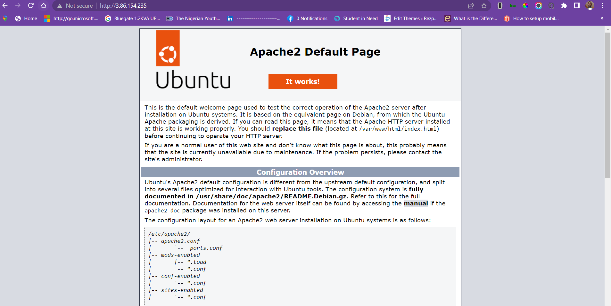
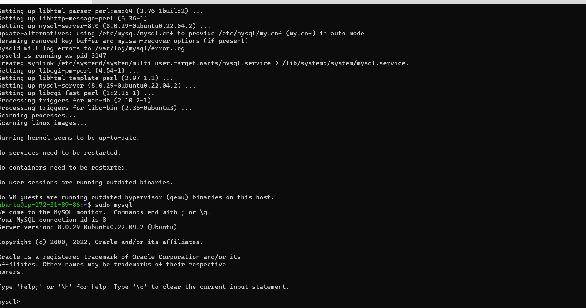
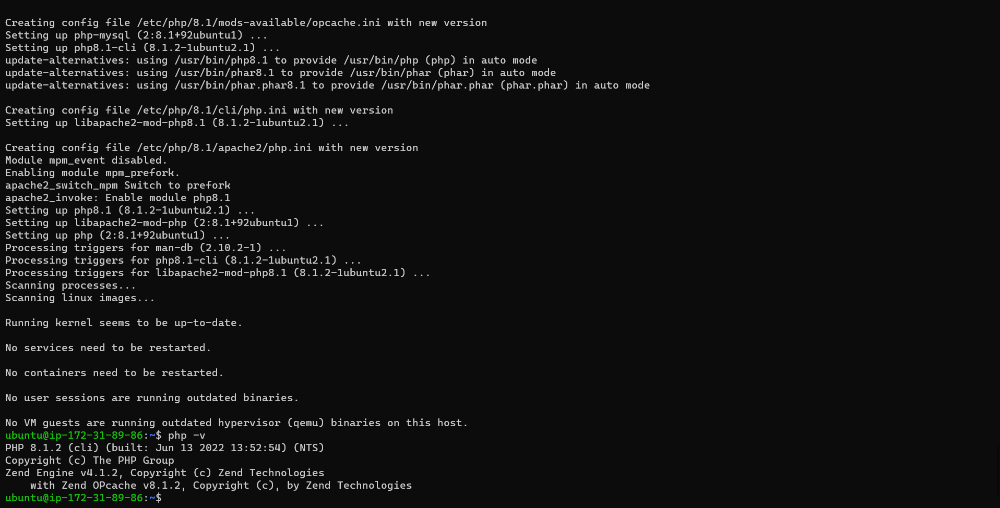
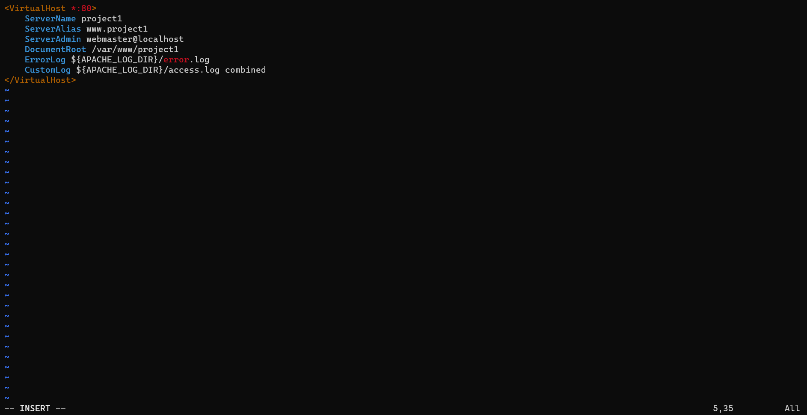
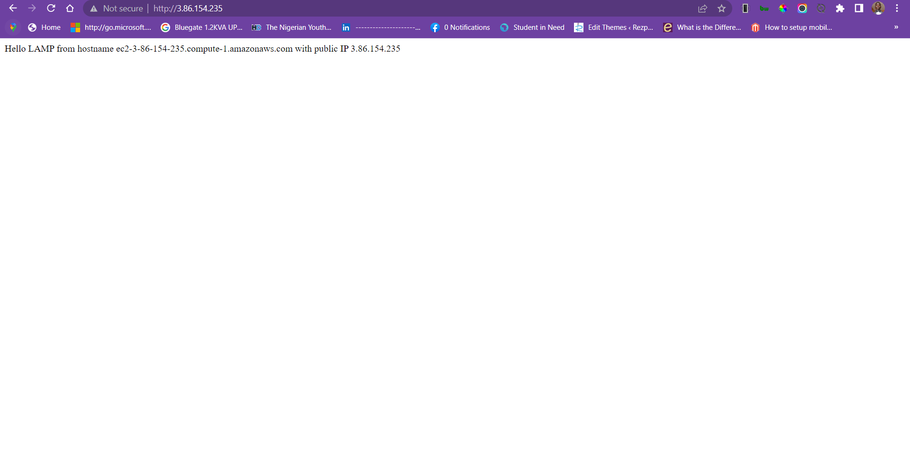

## Project 1

### Installation of LAMP Stack

Sign in into AWS and launch ubuntu instance

 

---

Login into EC2 

---

Install Apache

---
Mysql Login

---
Installation of Php 

---
Setting up virtualhost 

---
Configuring Virtualhost

---

Diplay of php information on Ipv4

---

For security purpose, remove the php information because of sensitive data 

**This is an installation of LAMP server on EC2**